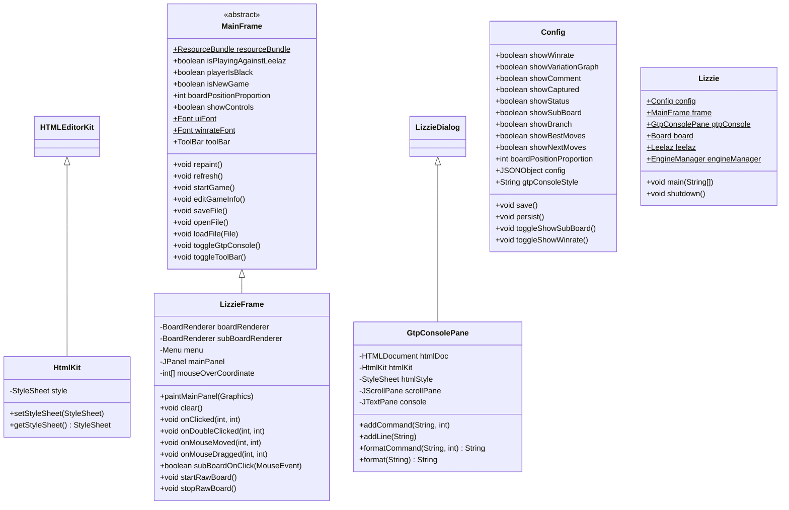
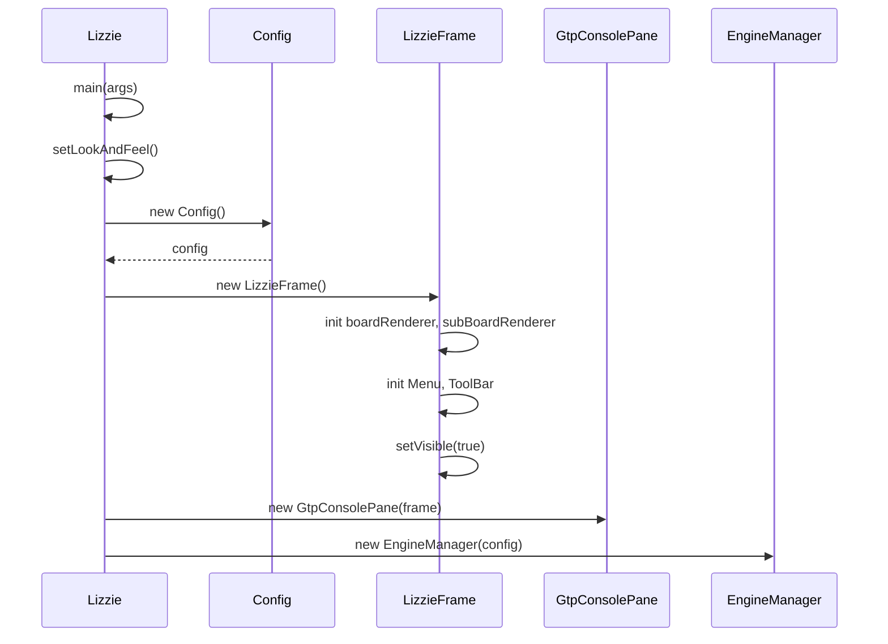
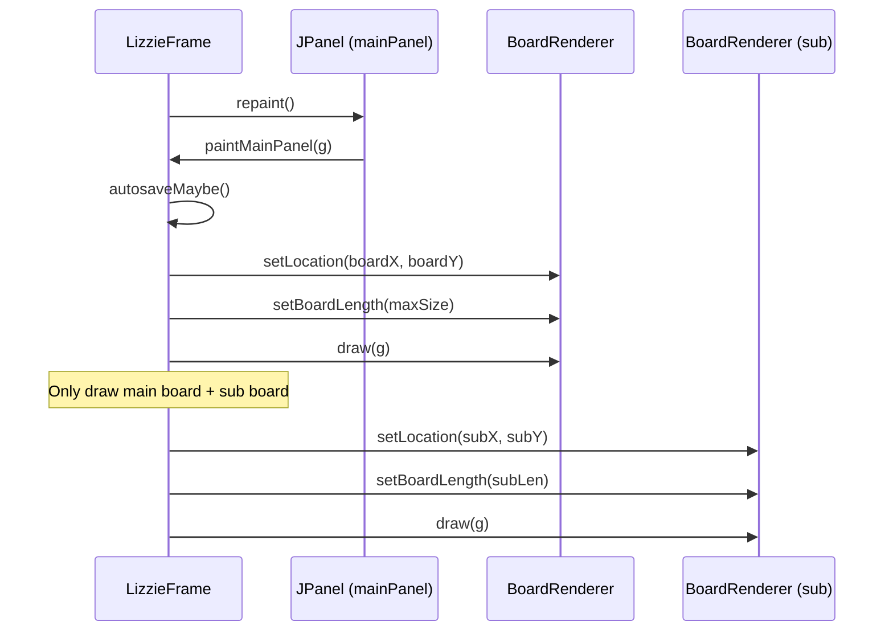
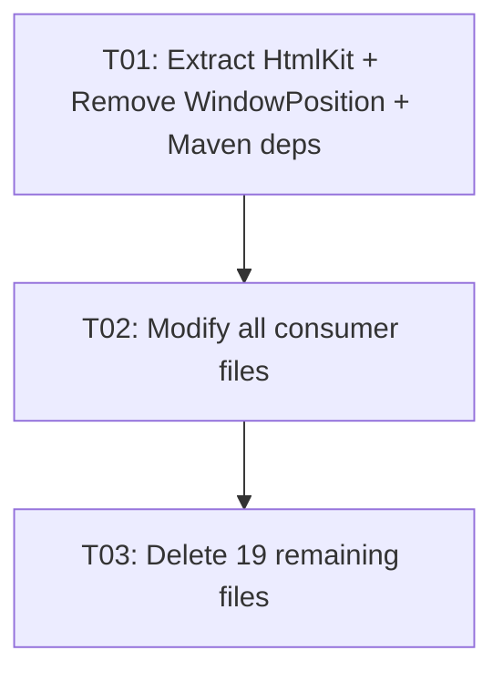

# Lizzie Simplify — System Design

## Part A: System Design

### 1. Implementation Approach

#### Core Technical Challenges

1. **HtmlKit extraction**: `LizziePane.HtmlKit` (inner static class) is used by `GtpConsolePane` but `LizziePane` must be deleted. Must be extracted to standalone class first.
2. **Tightly-coupled panel subsystem**: `LizzieMain` → `LizzieLayout` + 6 `LizziePane` subclasses → `LizziePaneUI`/`BasicLizziePaneUI` → `LizziePane`. All 12 files form an inseparable dependency cluster that must be deleted atomically.
3. **WindowPosition dependency**: Both `Config.java` and `GtpConsolePane.java` import `WindowPosition`. Must inline position-saving logic before deletion.
4. **Abstract method contracts**: `MainFrame` declares abstract methods implemented by both `LizzieFrame` and `LizzieMain`. Removing `LizzieMain` requires making those methods concrete or removing them entirely.

#### Architecture Pattern

From: Dual-mode (LizzieMain panel mode / LizzieFrame single-window mode) with pluggable panes  
To: **Single-window only (LizzieFrame)** with inline board rendering

No new frameworks needed. This is a pure deletion/simplification refactoring.

### 2. File List (post-refactor)

```
src/main/java/featurecat/lizzie/
├── Lizzie.java                          # [MODIFIED] Fixed to LizzieFrame only
├── Config.java                          # [MODIFIED] Remove panelUI, WindowPosition
├── analysis/
│   ├── Branch.java
│   ├── EngineManager.java
│   ├── GameInfo.java
│   ├── Leelaz.java
│   ├── LeelazListener.java
│   ├── MoveData.java
│   └── YaZenGtp.java
├── gui/
│   ├── AvoidMoveDialog.java
│   ├── BoardRenderer.java
│   ├── CountResults.java
│   ├── GameInfoDialog.java
│   ├── GtpConsolePane.java              # [MODIFIED] Use HtmlKit, remove WindowPosition
│   ├── HtmlKit.java                     # [NEW] Extracted from LizziePane
│   ├── Input.java                       # [MODIFIED] Remove dialog shortcuts
│   ├── LeftTextField.java
│   ├── LizzieDialog.java
│   ├── LizzieFrame.java                 # [MODIFIED] Simplified paintMainPanel
│   ├── MainFrame.java                   # [MODIFIED] Remove dialog/panel references
│   ├── Menu.java                        # [MODIFIED] Remove dialog menu items
│   ├── NewGameDialog.java
│   └── ToolBar.java
├── rules/
│   ├── Board.java
│   ├── BoardData.java
│   ├── BoardHistoryList.java
│   ├── BoardHistoryNode.java
│   ├── GIBParser.java
│   ├── MoveList.java
│   ├── RegionOfInterest.java
│   ├── SGFParser.java
│   ├── Stone.java
│   └── Zobrist.java
├── theme/
│   └── Theme.java
└── util/
    ├── DigitOnlyFilter.java
    ├── EncodingDetector.java
    └── Utils.java

DELETED (20 files):
  gui/LizzieMain.java, gui/LizzieLayout.java, gui/LizziePane.java,
  gui/LizziePaneUI.java, gui/BasicLizziePaneUI.java, gui/BoardPane.java,
  gui/SubBoardPane.java, gui/BasicInfoPane.java, gui/WinratePane.java,
  gui/WinrateGraph.java, gui/VariationTreePane.java, gui/VariationTree.java,
  gui/CommentPane.java, gui/OnlineDialog.java, gui/ConfigDialog.java,
  gui/EngineParameter.java, gui/RightClickMenu.java, gui/ChangeMoveDialog.java,
  util/AjaxHttpRequest.java, util/WindowPosition.java
```

### 3. Data Structures and Interfaces



### 4. Program Call Flow

#### Startup Flow (Post-Refactor)



#### Board Rendering Flow (Simplified)



### 5. Anything UNCLEAR

- **AvoidMoveDialog**: Not in deletion list. It's a modal dialog (not a panel), so kept. The shortcut `Alt+A` in Input.java is preserved.
- **CountResults**: Kept because YaZenGtp.java imports it. Not in deletion list.
- **YaZenGtp / estimateByZen**: These are analysis features (not panels), so kept. The estimate-by-zen functionality remains in LizzieFrame.
- **Config fields** (`showWinrate`, `showVariationGraph`, `showComment`, `showCaptured`): These Config boolean fields are kept to avoid breaking config.txt backward compatibility, but corresponding rendering code in LizzieFrame is removed.
- **Maven plugins** (fmt-maven-plugin, appbundle-maven-plugin): Kept as-is.

---

## Part B: Task Decomposition

### 6. Required Packages

No new packages needed. The following dependencies are **removed** from `pom.xml`:

```
- org.java-websocket:Java-WebSocket:1.5.0
- io.socket:socket.io-client:2.0.1
- org.slf4j:slf4j-simple:1.7.25
```

### 7. Task List (ordered by dependency)

---

#### T01: 提取 HtmlKit + 移除 WindowPosition + 清理 Maven 依赖

**Task ID**: T01  
**Priority**: P0  
**Dependencies**: None

**Source Files**:

| Action | File | Description |
|--------|------|-------------|
| CREATE | `gui/HtmlKit.java` | Extract `LizziePane.HtmlKit` as standalone class. Same code: extends `HTMLEditorKit`, overrides `setStyleSheet`/`getStyleSheet`. Package: `featurecat.lizzie.gui` |
| MODIFY | `gui/GtpConsolePane.java` | Replace `LizziePane.HtmlKit` → `HtmlKit` (remove `LizziePane.` prefix). Replace `WindowPosition.gtpWindowPos()` with inline logic (return null → use default bounds). Remove `import featurecat.lizzie.util.WindowPosition` |
| MODIFY | `Config.java` | Remove `import featurecat.lizzie.util.WindowPosition`. In `createPersistConfig()`, replace `WindowPosition.create(ui)` with inline JSON defaults. In `persist()`, replace `WindowPosition.save(persistedUi)` with inline position saving. |
| MODIFY | `pom.xml` | Remove 3 dependencies: `org.java-websocket:Java-WebSocket`, `io.socket:socket.io-client`, `org.slf4j:slf4j-simple` |
| DELETE | `util/WindowPosition.java` | No longer referenced after Config.java and GtpConsolePane.java modifications |

**Verification**: `mvn compile` passes. HtmlKit is standalone, all WindowPosition references are removed.

---

#### T02: 修改所有保留文件，移除对删除文件的引用

**Task ID**: T02  
**Priority**: P0  
**Dependencies**: T01

**Source Files**:

| Action | File | Key Changes |
|--------|------|-------------|
| MODIFY | `Lizzie.java` | Remove `import featurecat.lizzie.gui.LizzieMain`. Change `mainInEDT()`: `frame = new LizzieFrame()` unconditionally (remove `config.panelUI` ternary). Remove `panelUI` field reference. |
| MODIFY | `Config.java` | Remove `public boolean panelUI = true` field declaration and `panelUI = uiConfig.optBoolean("panel-ui", false)` initialization. |
| MODIFY | `MainFrame.java` | **Remove fields**: `onlineDialog`, `countResults`. **Remove methods**: `openConfigDialog()`, `openConfigDialog(int)`, `openOnlineDialog()`, `openChangeMoveDialog()`, `getToolBarPosition()`. **Remove abstract methods**: `openRightClickMenu`, `processCommentMouseWheelMoved`, `processSubBoardMouseWheelMoved`, `incrementDisplayedBranchLength`, `playCurrentVariation`, `playBestMove`, `estimateByZen`, `noAutoEstimateByZen`, `noEstimateByZen`, `drawEstimateRectZen`, `updateEngineMenuInEDT`, `updateEngineIconInEDT`, `convertScreenToCoordinates`, `updateScoreMenu`, `clearBeforeMove`, `clearIsMouseOverSub`, `updateBasicInfo` (both overloads), `removeEstimateRectInEDT`, `drawEstimateRectKataInEDT`, `saveImage`, `toggleDesignMode`, `isDesignMode`, `replayBranch`, `refreshBackground`, `resetImages`, `clear`, `isMouseOver`, `onClicked`, `onDoubleClicked`, `onCenterClicked`, `subBoardOnClick`, `onMouseDragged`, `onMouseMoved`, `startRawBoard`, `stopRawBoard`, `copySgf`, `pasteSgf`, `increaseMaxAlpha`, `doBranch`, `addSuggestionAsBranch`, `drawControls`, `editComment`, `copyCommentToClipboard`. Move concrete implementations of needed methods directly into `MainFrame` as default. **Remove imports**: `YaZenGtp`, `GIBParser` (if unused), `LizzieLayout` related. |
| MODIFY | `Menu.java` | Remove `openUrl` menu item (line 70-78, `openOnlineDialog()`). Remove `configMenu` section items: `engineConfig`, `viewConfig`, `themeConfig`, `about` (lines 1428-1469, `openConfigDialog(N)`). |
| MODIFY | `Input.java` | Remove `VK_Q` handler (opens OnlineDialog). Remove `VK_M` + Alt handler (opens ChangeMoveDialog). Remove `VK_X` + Ctrl handler (opens ConfigDialog). Keep `VK_A` + Alt handler (AvoidMoveDialog — not deleted). |
| MODIFY | `LizzieFrame.java` | **Remove fields**: `variationTree`, `winrateGraph`, `rightClickMenu`, `scrollPane`, `commentPane`, `cachedCommentImage`, `cachedComment`, `commentRect`. **Remove from constructor**: initialization of VariationTree, WinrateGraph, comment components. **Simplify `paintMainPanel()`**: remove all winrate graph drawing, variation tree drawing, comment drawing, captured drawing, move statistics drawing, status display; keep only `boardRenderer.draw(g)` and `subBoardRenderer.draw(g)`. **Remove methods**: `drawControls()`, `drawCommandString()`, `drawMoveStatistics()`, `drawCaptured()`, `drawComment()`, `createCommentImage()`, `drawContainer()`, `drawPonderingState()`, `processCommentMouseWheelMoved()`, `openRightClickMenu()`, `showMenu()`, `setPanelFont()`. **Simplify `onClicked()`**: remove winrateGraph/variationTree click handling. **Fix references**: remove all deleted-field usages. |

**Verification**: `mvn compile` passes. All remaining files no longer reference any deletion-list file. Deletion files still exist and compile among themselves.

---

#### T03: 批量删除 19 个文件

**Task ID**: T03  
**Priority**: P0  
**Dependencies**: T02

**Source Files** (all DELETE):

```
gui/LizzieMain.java           # Panel mode main window
gui/LizzieLayout.java         # Custom layout for panel mode
gui/LizziePane.java           # Base panel class (HtmlKit already extracted in T01)
gui/LizziePaneUI.java         # Panel UI delegate class
gui/BasicLizziePaneUI.java    # Panel UI implementation
gui/BoardPane.java            # Main board panel
gui/SubBoardPane.java         # Sub board panel
gui/BasicInfoPane.java        # Basic info panel (captures, status)
gui/WinratePane.java          # Winrate bar panel
gui/WinrateGraph.java         # Winrate graph rendering
gui/VariationTreePane.java    # Variation tree panel
gui/VariationTree.java        # Variation tree rendering
gui/CommentPane.java          # Comment panel
gui/OnlineDialog.java         # Online play dialog
gui/ConfigDialog.java         # Configuration dialog
gui/EngineParameter.java      # Engine parameter helper (only used by ConfigDialog)
gui/RightClickMenu.java       # Right-click context menu
gui/ChangeMoveDialog.java     # Change move dialog
util/AjaxHttpRequest.java     # HTTP utility (only used by OnlineDialog)
```

**Verification**: `mvn compile` passes. No remaining file references any deleted file.

---

### 8. Shared Knowledge

```
- All Config.java boolean fields (showWinrate, showVariationGraph, showComment, etc.)
  are KEPT to maintain backward compatibility with existing config.txt files.
  Their rendering code is removed but the fields remain.
- The `panel-ui` config key in config.txt becomes a no-op (always LizzieFrame mode).
- All dates stored as ISO 8601 UTC (unchanged).
- GtpConsolePane position defaults to derived-from-owner when no persisted position exists.
- Java source/target level: 1.8 (unchanged).
```

### 9. Task Dependency Graph



**Compilation gates**:
- After T01: ✓ All files compile (HtmlKit is new, WindowPosition gone, removed deps don't affect Java compilation)
- After T02: ✓ All files compile (remaining files don't reference deleted ones; deleted files still compile among themselves)
- After T03: ✓ All files compile (deleted files gone, no remaining references to them)
